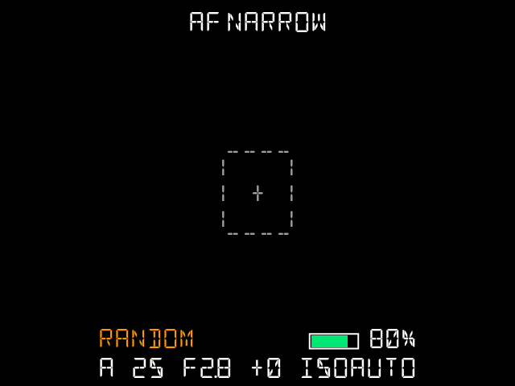
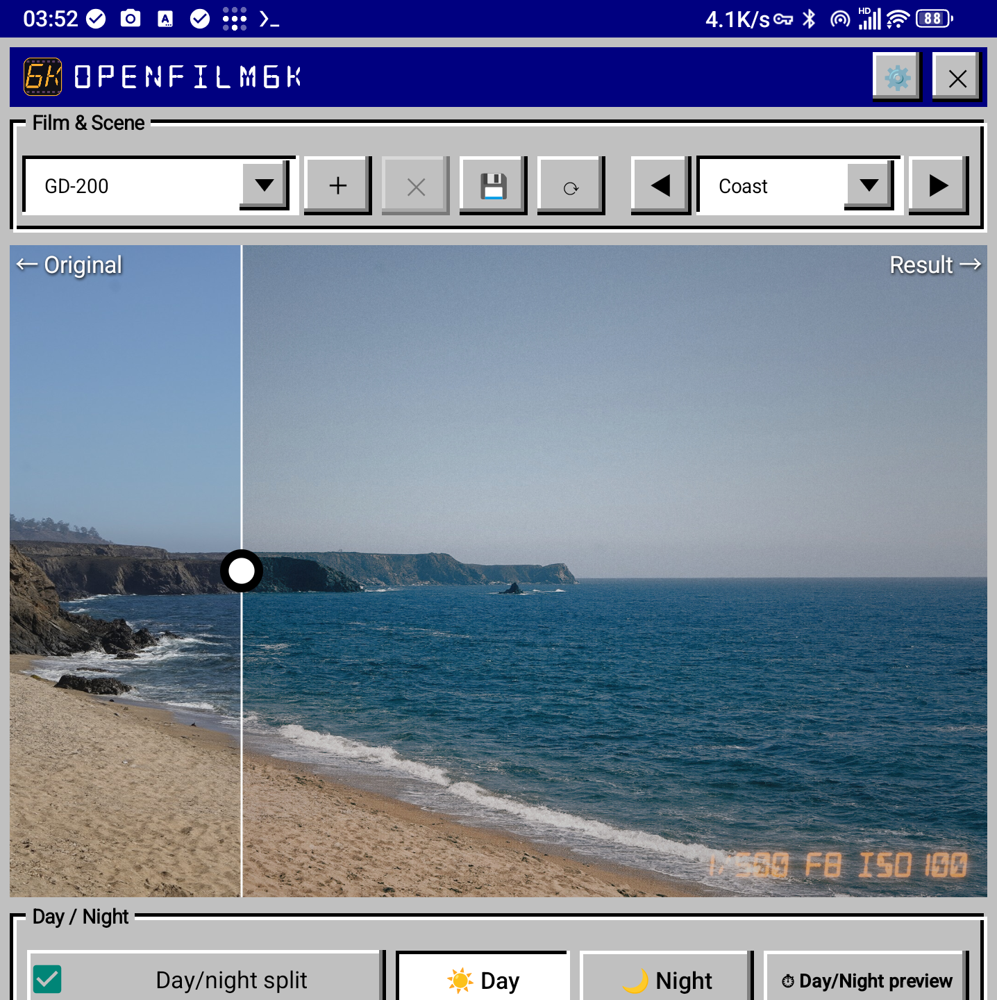
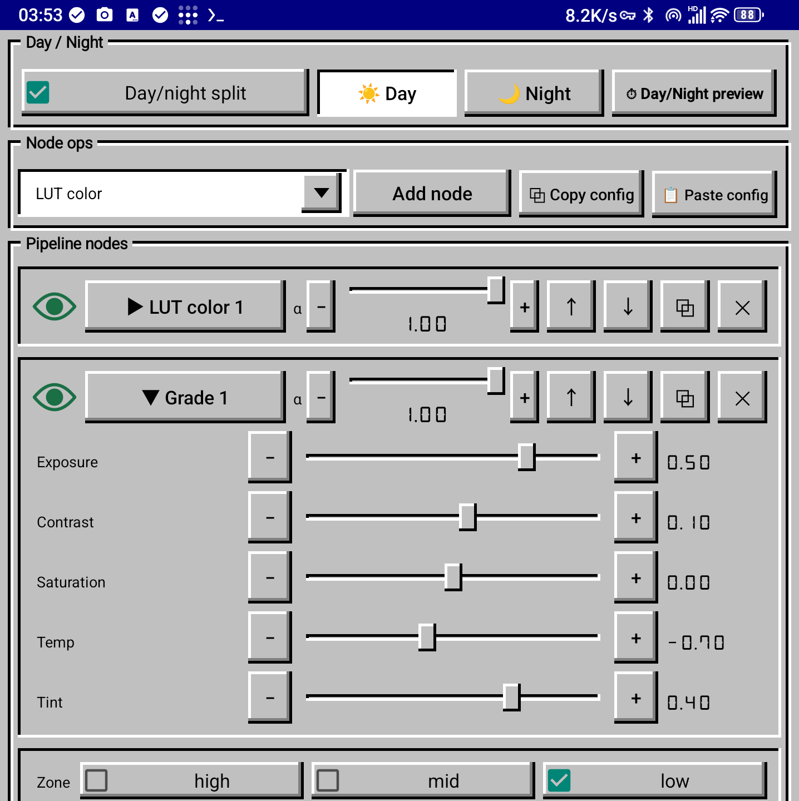
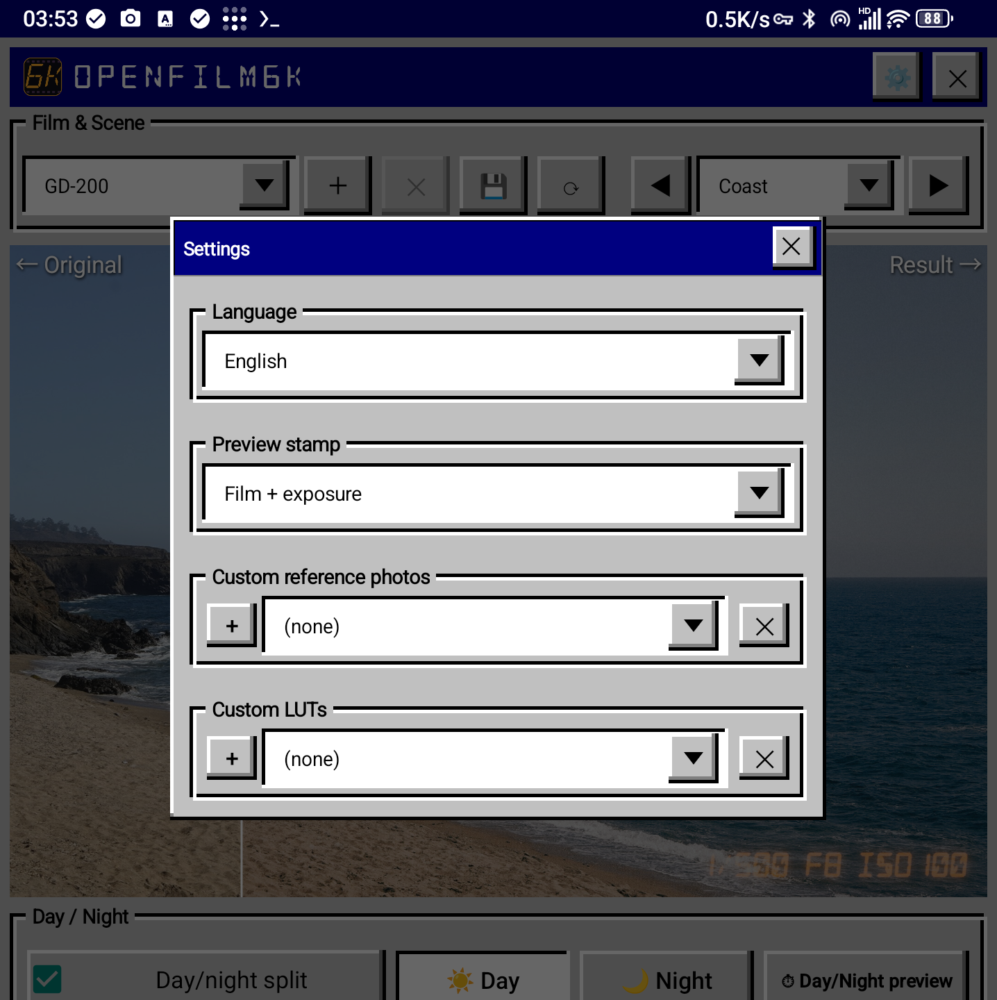

# OpenFilm6K

**Film simulation for Sony A6000 cameras.**

OpenFilm6K is an open-source film-simulation system for the Sony A6000. Shoot with the camera, and your Android phone renders the final film-look photo automatically — LUT color, halation glow, grain, vignette and more, all editable in a node-graph editor.

```
┌────────────┐   photo (HTTP)   ┌──────────────────────┐
│  A6000     │ ───────────────▶ │  Android phone       │
│  camera    │ ◀─────────────── │  render host + editor│
│  (camera/) │  film list ping  │  (host/)             │
└────────────┘                  └──────────────────────┘
```

| Directory | What it is |
|---|---|
| `host/` | Android app: render host + node-graph film editor (Java + GLES3, plus a native C++ engine) |
| `host/films/` | Bundled film stocks: `pipelines/*.properties` (node chains) + `luts/*.cube` |
| `camera/` | Android app for the camera itself: capture, manual controls, upload to the host |
| `docs/screenshots/` | Usage screenshots |

## Screenshots

### The camera app (on the A6000)



### The phone app (render host + editor)

|  |  |  |
|---|---|---|

## Installation

### Prerequisites

- Android SDK (build-tools 30.0.3 + 36.0.0, platform android-28), NDK (a recent clang toolchain for arm64 **and** NDK r16 `ndk-build` for the camera), JDK 8–17.
- An Android phone (the render host) and a Sony A6000 with a side-load ability for camera apps (developer-friendly firmware access, e.g. the [PMCA installer](https://github.com/ma1co/Sony-PMCA-RE) or `adb` over Wi-Fi).
- The phone and the camera must be on the same Wi-Fi network (the camera connects to the phone's hotspot or shared network; the phone's IP must be the network gateway — this is how the camera finds the host).

### 1. Build the APKs

```bash
# phone host — produces OpenFilm6K-Host.apk
cd host && bash build/build.sh

# camera app — produces OpenFilm6K-Camera.apk
cd camera && bash build.sh
```

### 2. Install the phone host

Install `OpenFilm6K-Host.apk` on the Android phone like any APK, then launch it once. On first launch the app:

- starts the render host on port **8800** (a persistent status-bar notification shows it is running),
- creates its data folders on the SD card.

### 3. First launch

Two permissions are involved on first launch:

- **File access (required)** — on first start the app asks for storage access (**All files access** on Android 11+; a plain storage permission on older versions). Grant it: without it the bundled film library cannot install.
- **Accessibility service (optional)** — if you want the app to stay resident in the background (recommended when using it as the camera's render host), enable it in the system settings: **Settings → Accessibility → OpenFilm6K**.

After file access is granted, the film library (19 film pipelines, LUTs and scene previews) — bundled **inside the host APK** — installs itself automatically: a progress dialog writes it to `/sdcard/OpenFilm6K/`, and a result dialog reports the file count. The install is **incremental**: only missing files are written, so existing edits and custom films stay as they are. After upgrading the APK you can pull in newly bundled files from **Settings → Reinstall data** (same progress dialog, also incremental).

### 4. Install the camera app on the A6000

Side-load `OpenFilm6K-Camera.apk` onto the camera ([PMCA installer](https://github.com/ma1co/Sony-PMCA-RE), or `adb connect <camera-ip>:5555 && adb install -r OpenFilm6K-Camera.apk`). Launch it from the camera's application list.

The camera app needs **no film assets on the camera** — it pulls the film list from the phone at runtime and uploads every shot for rendering.

> Note: the camera's SD-card filesystem (Sony FuFsys) only lets the app write into pre-existing directories. The app writes its log (`LOG.TXT`) to the first writable folder (`OpenFilm6K`, `DCIM/OpenFilm6K`, `DCIM`).

## Using the camera app

The camera app is controlled entirely with the camera's physical keys (no touchscreen).

### Boot & connection

First connect the camera to the Wi-Fi hotspot of the phone that runs the host app. On launch the app joins the network, pings the phone host (`:8800`), pulls the film list, and shows the live viewfinder. The HUD shows film, exposure, battery and AF status.

### Keys

Every action is available on every supported body — only the key that carries it
differs: **buttons down the left, bodies across the top.**

| Button | α6000 | α7 series | NEX series |
|---|---|---|---|
| Shutter ½ | auto-focus (center / spot) | auto-focus | auto-focus |
| Shutter full | shoot → grade → upload | shoot → grade → upload | shoot → grade → upload |
| ↑ ↓ ← → | move the highlight (Mode / Shutter / Aperture / ISO / EV / Film) | move the highlight | move the highlight |
| Center | cycle camera mode (P→A→S→M); in the film browser, load the film | cycle camera mode; in the film browser, load the film | confirm / cycle camera mode; in the film browser, load the film |
| Fn | open the film browser | open the film browser | short: open the film browser · long: cycle favourite films · in the film browser: toggle favourite |
| AEL | short: enter/exit focus-area adjust · long: screen-lock (3 s countdown, any key wakes) | short: focus-area adjust · long: screen-lock | “Soft key A”: short: focus-area adjust · long: screen-lock |
| C1 | hold + a dial: cycle favourite films; in the film browser: toggle favourite | hold + a dial: cycle favourite films; in the film browser: toggle favourite | — (merged into Fn) |
| C2 | short: cycle watermark · long: switch LCD/EVF view | short: cycle watermark · long: switch LCD/EVF view | “Soft key B”: short: cycle watermark · long: switch LCD/EVF view |
| C3 | — | quick AF-area-mode switch | — |
| C4 | — | same as C2 | — |
| MENU | quit the app | quit the app | — |
| Front dial | — | select film | — |
| Rear dial | exposure compensation (EV) | exposure compensation (EV) | exposure compensation (EV) |
| Control wheel | adjust the highlighted parameter | adjust the highlighted parameter | adjust the highlighted parameter |

Watermark modes (C2 / Soft key B short press) — the status bar shows a symbol:
*(blank)* none · **D** date · **E** exposure · **DE** date + exposure · **B**
polaroid frame · **X** four-film collage · **F** film name · **FE** film name +
exposure. Exposure = shutter / aperture / ISO, e.g. `1/60 F2.8 ISO400`.

- The NEX series has no MENU key — the app cannot be quit from its keypad — and
  its C1 action is merged into Fn.
- `PLAY` and `MOVIE` are consumed by the camera firmware before the app sees them.

### Film browser (FN)

Lists `random`, `favorite` and all films pulled from the phone. `>` marks the cursor, `*` the loaded film. ENTER loads a film; it becomes the default for subsequent shots.

### Shooting flow

Every full press: focus → capture → the photo is POSTed to the phone (`/ingest`) with the selected film and watermark mode → the phone renders it through the film pipeline and stores the graded result in the gallery album **OpenFilm6K** (`DCIM/OpenFilm6K`). The phone's status-bar notification updates with the graded thumbnail, the film name, the exposure and the capture time — tap it to open that photo in the gallery.

If the phone is unreachable the camera keeps the originals on its SD card and retries automatically after reconnecting.

## Using the phone app

### Desktop & first launch

Launching OpenFilm6K shows the editor. The desktop area carries the app icon, a one-line description, and the author/links row.

### The editor

The editor edits **film pipelines**: each film is a chain of nodes; each node is one processing step.

- **Film & Scene group** — film selector (combobox), `New film` (blank or copy-of-current, any language name), `Delete film` (user films only; official films are locked), `Save to film` (writes the whole chain back), `Reload` (discard edits), and the scene selector (reference scenes + your own imported photos).
- **Day / Night group** — a film can carry **two calibrations**: `Day/night split` copies the current parameters into day and night halves (tabs ☀ Day / 🌙 Night). After saving, the host picks the right half automatically at ingest time; `⏱ Day/Night preview` compares both. The `Day/night` score line estimates how day- or night-like the loaded photo is.
- **Node ops group** — `Add node` (choose type: LUT color, Grade, Glow, Grain, Vignette, Sharpen, Overlay, Hue shift), `⧉ Copy config` / `📋 Paste config` for whole chains, per-node `Hide/Show` toggle, node deletion, and per-node parameter sliders.
- **Parameters** — every node exposes its parameters as sliders: exposure, contrast, saturation, temperature/tint, shadows/mids/highlights, glow threshold & radius, grain size/mono, vignette range, overlay blend & scale, hue presets, etc.
- **Settings dialog (⚙)** — import **custom reference photos** (jpg) and **custom LUTs** (`.cube`), delete them, switch the **language** (10 languages), preview the **watermark stamp** styles.
- **Preview** — the main viewer shows the original (left) and the graded result (right); drag the divider to compare. Annotation mode: drag a box on the image to attach a note.

### Notification photo inbox

Each successful ingest updates the standing notification: graded thumbnail on the left, film name, exposure (`1/125s F3.5 ISO400`) and capture time on the right. Tapping opens that photo in the system gallery.

### Films

A set of film simulations is bundled (CV-250, CV-500, ET-100, ET-64, PR-100, CC-200, CS-800T, EV-500, FC-400, GD-200, LK-200, NC-200, PAN-100, PI-100, PT-400, PX-II, SP-200, UM-400). You can create your own films in the editor, or import extra `.cube` LUTs via the settings dialog.

## Building from source / repo layout

Both apps are built with plain `aapt`/`javac`/`d8`/NDK pipelines — no Gradle required. See `host/build/build.sh` and `camera/build.sh`.

## Third-party components

| Component | Used for | Where | License |
|---|---|---|---|
| [libjpeg-turbo](https://github.com/libjpeg-turbo/libjpeg-turbo) | JPEG codec in the host's native render engine | `host/jni/turbo/` | BSD-style + IJG |
| [IJG libjpeg 9e](https://www.ijg.org) | JPEG codec in the camera app | `camera/jni/libjpeg/` | IJG License |
| [DSEG fonts](https://github.com/keshikan/DSEG) | 7/14-segment display typefaces for the HUD and readouts | `camera/assets/`, `host/res/raw/` | SIL OFL 1.1 |

Full license texts: [`THIRD_PARTY/`](THIRD_PARTY/).

## License

GPL-3.0 — see [LICENSE](LICENSE).

## Author

NekoV — phaseneko@gmail.com — github.com/phaseneko

## Other languages

[简体中文说明](README-cn.md)
